## 미션 수행한 깃허브 리포지토리 링크
https://github.com/ye-zin/umc9th/tree/Feat/Chapter4

## DB 사진
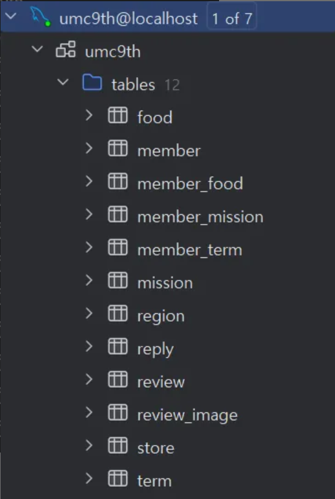

## 각 테이블 DDL
### member
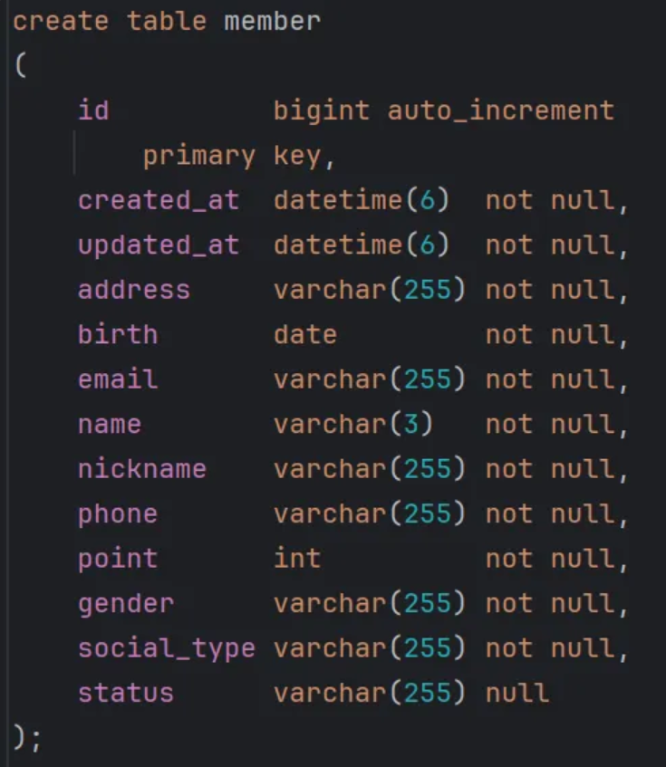

### member_food
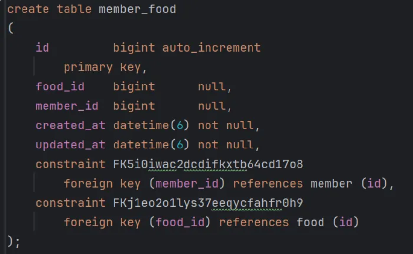

### member_mission
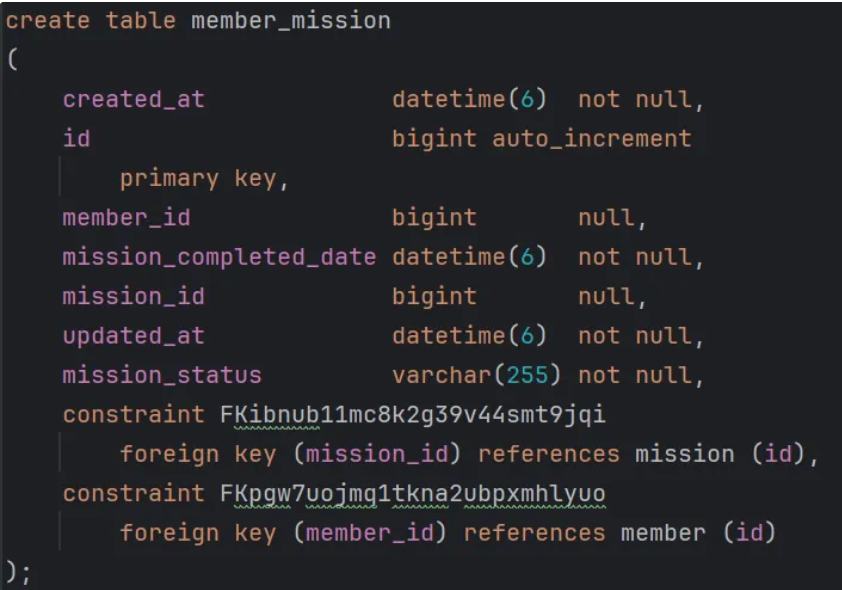

### member_term
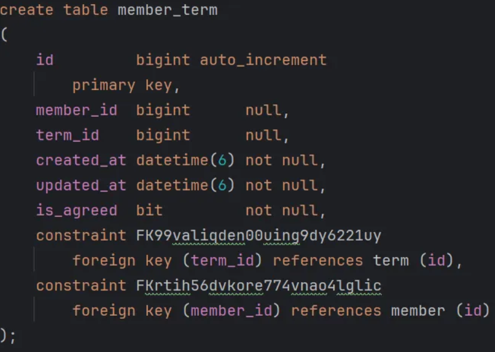

### food
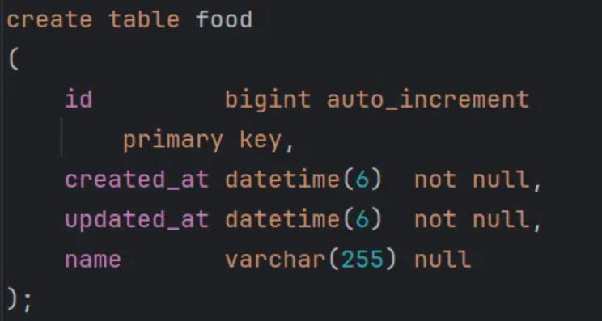

### term
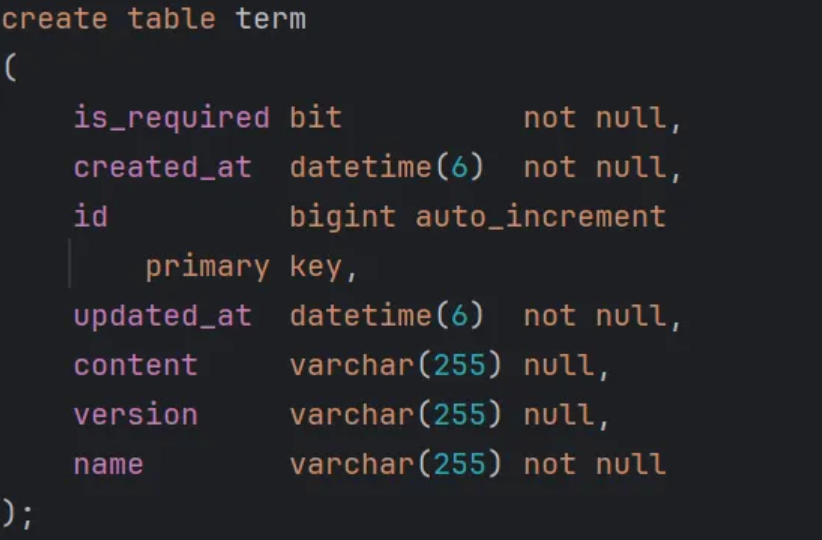

### mission
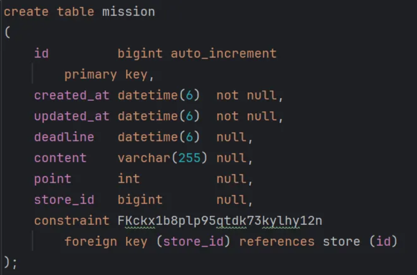

### store
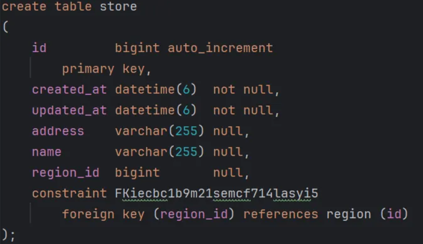

### region
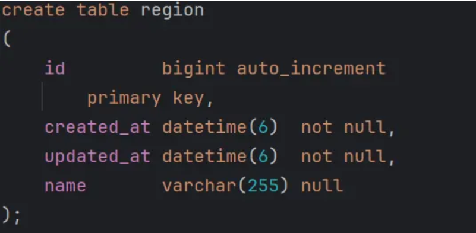

### review
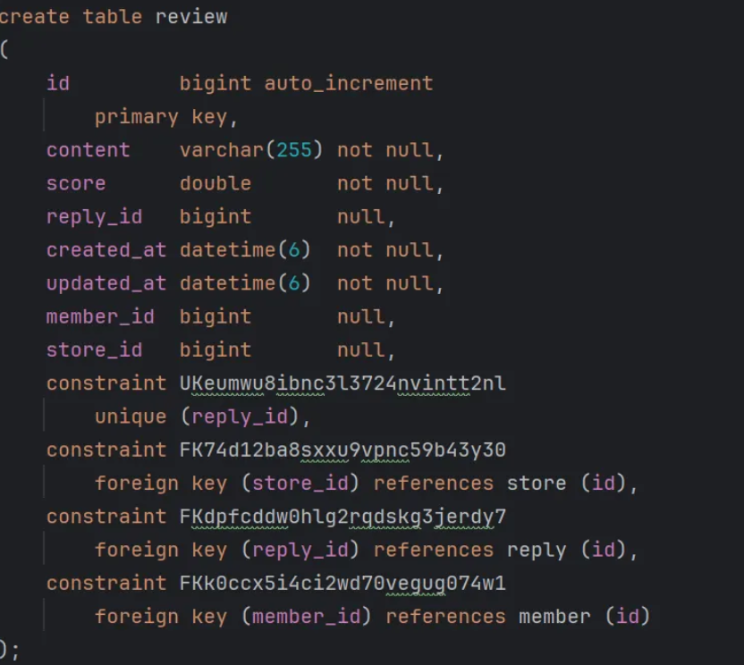

## review_image
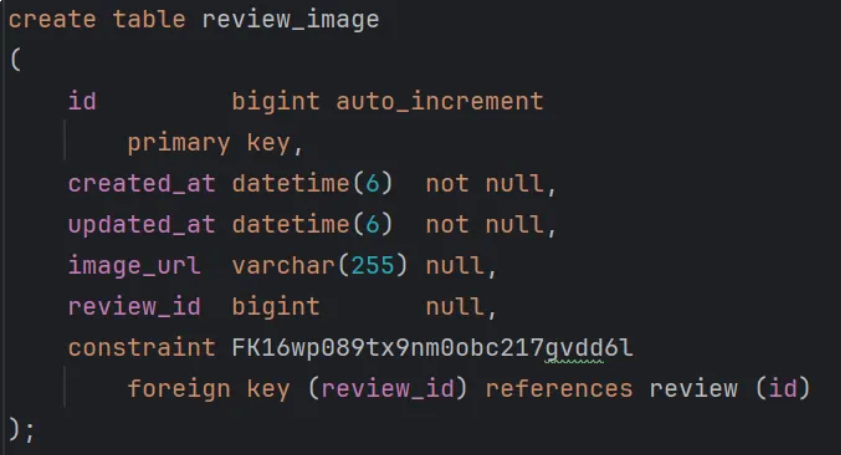

### reply
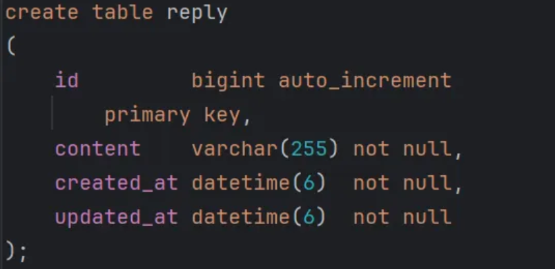